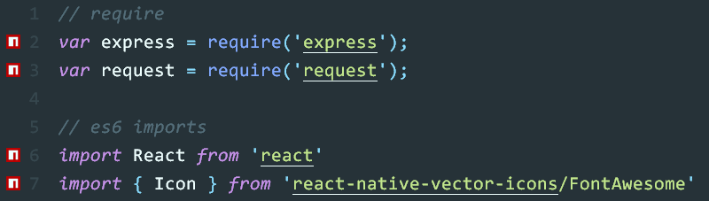

# `npm-install` for sublime text 3
Show NPM icon near npm modules, auto install modules.

## Keyboard Shortcut
`ctrl+i`/`⌘+i` check and install/uninstall modules.

## Preferences

- `install_on_save`: true (*default*)
install/uninstall modules on save.

